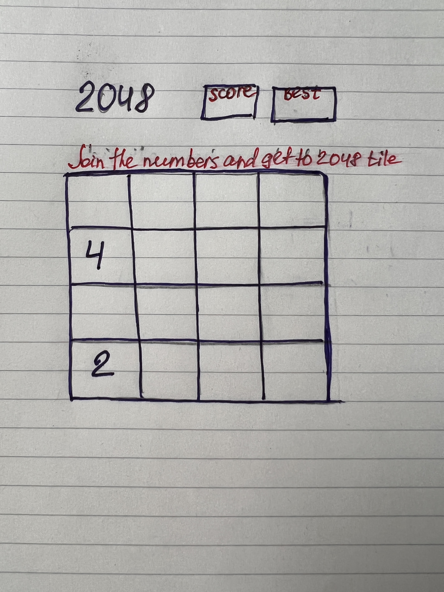

# 2048

## Projecr Description
Single player on WEB or mobile application that let you move blocks of tiles with numbers on it.
Each time two blocks unite together - numbers multiply by 2. The goal is to get to number 2048 or higher. Player loses the game when no more possible moves available. Layout of the page will show the layout of the game with puzzle blocks, name of the game, block for current score, block for best score, move arrows and a line of the one main rule.

## Wireframes

## MVP Goals
* As a user I want to be  able to move tiles into 4 deifferent directions ( top, bottom,left and right).
* As a user I want to be able to see my current score and best score
* As a user I want to be able to be able to start a new game
* As a user I want to see "You Won!" sign if user got to 2048 tile.
* If user lost the display would show "You lost!" + current score.
 

## Proposal Steps

* Create 4x4 gameboard with 16 tiles.
* At the begining of the game gameboard already has with random values of 2 or 4.
* Create arrows that will allow to transpose values into 4 different direction.
* Create a function that will unite collided equal values after transpose.
* New random values of 2 or 4 should appear on a vacant tile of gameboard after each move.
* Create a function that will test if player lost or won.

